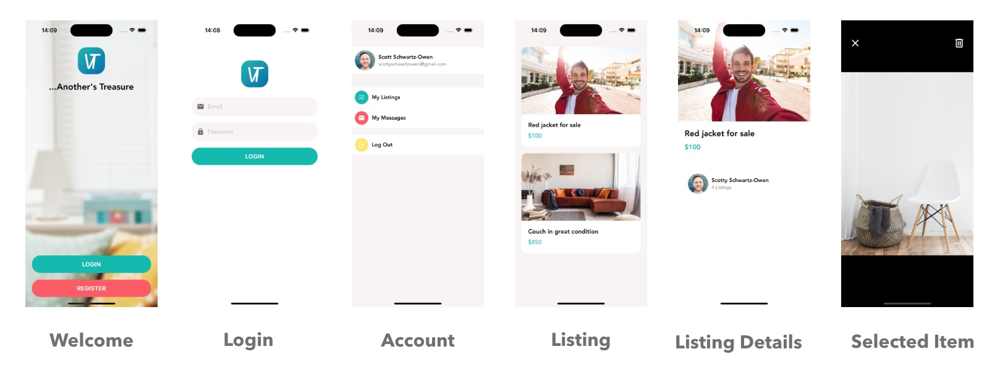
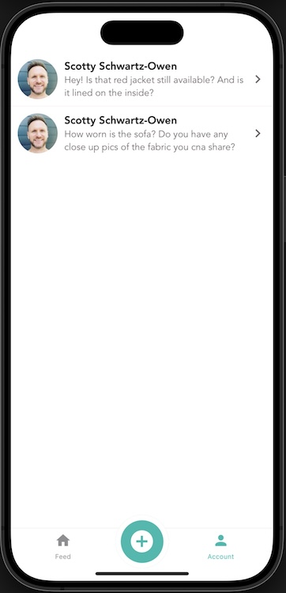

# VendThing: Sell Anything Community App - Tools Used:

- Created with React Native, coded 100% in JS / React Native

- I am currently developing this project following
  Mosh Hamedani's Int React Native course

- CSS Flexbox architecture, forms with Formik, validation with Yup

- React Navigation, custom Hooks, and API layer using ApiSauce

# App Features

- Launch screen and user account login authentication

- Tab bar access to user's feed, sell and item, account settings

- Messages screen with portal to interact with interested buyers

- Post items with local image picker, category sheet selector

- Current building: 
  Async store and cache layer with Redux
  Authentication flow and persistence
  Push notification server server services
  Over-the-air updates capabilities 
